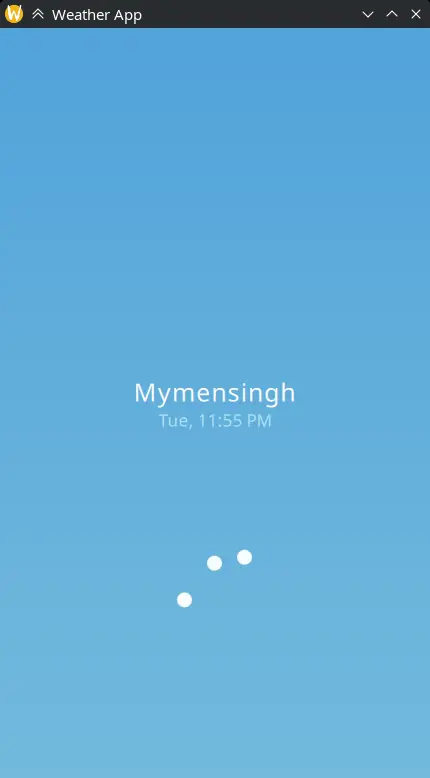
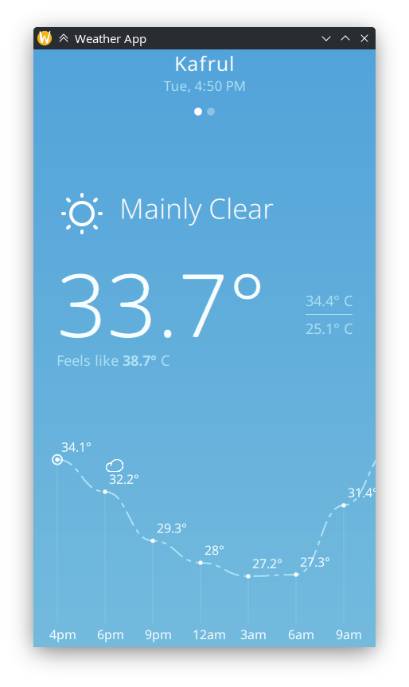
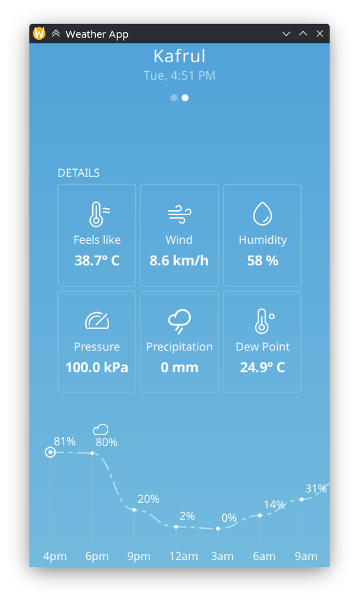
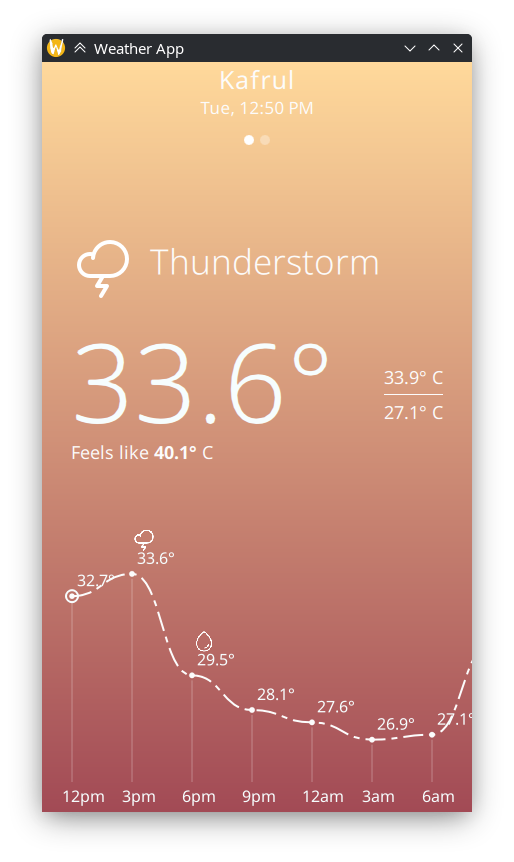
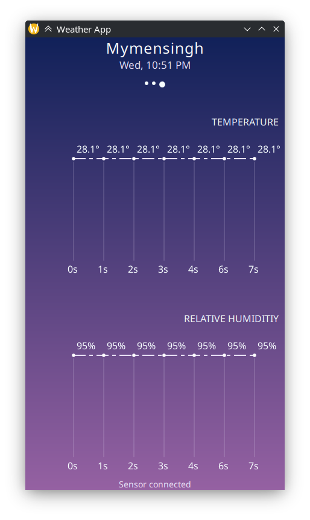

# QWeather
Yet Another beautifully simple, modern weather application with fluid animations.

# Features
1. Detects location via IP geolocation using **ip-api.com**
2. Fetches current and future hourly weather forecasts from **Open-Matro** and display them visually in swipeable pages.
3. Connects to local MCU through Serial and fetches live readings from **DHT11** sensor and plot temperature and humidity. [DHT11 Sensor C](<https://github.com/xRumi/AVR-projects/tree/main/DHT11 Sensor C>)

# Requirements
1. Qt6 (Quick, SerialPort)
2. C++, CMake

## Arch Linux
```
sudo pacman -S qt6-base qt6-serialport cmake
```
## Sensor Cautions
1. Serial is currently hardcodded to `/dev/ttyUSB0`, change it to relevant port in `SensorManager.h`
2. Ensure permissions required for that port.


# Building
```
cmake -S . -B build
cmake --build build
./build/qWeather
```

|| [Demo Video](<./assets/demo/demovideo.mp4>) |
|:-:|:-:|
||  |
|| 
